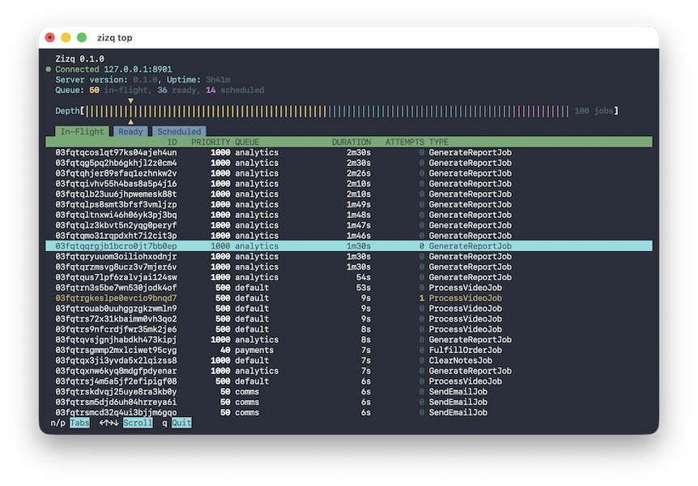

<p align="center">
    
</p>

Zizq is a fast and lightweight self-contained job queue. Download a single
binary, start the server then enqueue and process jobs in your preferred
programming language. You're just a `zizq serve` away.

## Features

Zizq supports a growing number of features.

* Single self-contained executable— no separate data store required
* No configuration files required
* Durable and atomic job queues
* Easy to use `HTTP/2` API with JSON or MsgPack (supports multiplexing)
* Cross-language job enqueueing and execution
* Arbitrary numbers of named queues
* FIFO + granular priority job execution
* Scheduled jobs
* Flexible backoff/retry policies
* Flexible job retention policies for completed and dead jobs
* APIs to manage the queue contents
* High job throughput— Over 50K jobs/second
* An insightful [`zizq top`](#viewing-live-queue-activity) command— visualize
  your queues in realtime in the terminal
* One backend that works across multiple programming languages

## Documentation

Read the full documentation at [zizq.io/docs](https://zizq.io/docs).

## Getting started

Download [a release](https://github.com/zizq-labs/zizq/releases) compatible
with your system and unzip it. You should put the executable somewhere on your
`PATH` but you can also just run it from the current directory.

### Starting the server

Zizq is a single binary organised into subcommands. The `serve` subcommand
starts the server. This is the default when no other subcommand is specified.

```shell
$ ./zizq serve
Zizq 0.1.0
Listening on 127.0.0.1:8901 (admin)
Listening on 127.0.0.1:7890 (primary)
```

If you have a [paid license](https://zizq.io/pricing), specify the license key
with `--license-key @/path/to/license.jwt`.

When the server starts, it creates a root directory in which it stores all
queue data. By default this directory is `{PWD}/zizq-root/` but can be
explicitly specified by providing the `--root-dir` flag, or by specifying the
`$ZIZQ_ROOT` environment variable. The server listens on `127.0.0.1` port
`7890` unless otherwise specified by `--host` and `--port`, or `$ZIZQ_HOST` and
`$ZIZQ_PORT`.

Run `zizq serve --help` to see a complete list of available options. The
defaults should be good even for production use, provided the server is not set
up to listen on a public IP address.

### Client libraries

Zizq provides client frontends for a number of programming languages. Language
not listed here? [Reach out to express interest](mailto:chris@zizq.io). Read
the documentation specific to the client implementation for usage.

* Ruby
* Python
* Node
* Rust
* Go

### Talking to the server

With the server up and running we can make some requests to enqueue and perform
some jobs. You would usually use a [client library](#client-libraries) to do
this, but the Zizq API is easy to use directly over HTTP too. Examples here use
[HTTPie](https://httpie.io/) for simplicity.

First we can check what version of the software is running on the server.

```shell
$ http GET 127.0.0.1:7890/version
HTTP/1.1 200 OK
content-length: 19
content-type: application/json
date: Thu, 12 Mar 2026 03:46:14 GMT

{
    "version": "0.1.0"
}
```

Jobs are enqueued with a HTTP POST request. The `queue` is required but
arbitrary. The `type` and `payload` fields are also arbitrary but required. The
`payload` is a JSON value provided to workers that will process this job.

The numeric `priority` is optional and is any value from `0` to `65536`. The
default is `32768`. Lower numbered priorities are processed earlier than higher
numbered priorities. Within each priority jobs are enqueued in FIFO order.

```shell
 $ http POST 127.0.0.1:7890/jobs \
   queue=example \
   priority:=500 \
   type=hello_world \
   payload:='{"greet": "World"}'
HTTP/1.1 201 Created
content-length: 143
content-type: application/json
date: Thu, 12 Mar 2026 03:50:20 GMT

{
    "attempts": 0,
    "id": "03fqs300nc99wa7twropnx7ed",
    "priority": 500,
    "queue": "example",
    "ready_at": 1773287420571,
    "status": "ready",
    "type": "hello_world"
}
```

The new job is immediately `"ready"`. With our job enqueued, we can connect a
worker and start receiving jobs that are ready to process. Workers remain
connected to this endpoint for as long as they are running, with jobs delivered
over a streaming response, along with periodic "blank message" heartbeats that
can be skipped.

```shell
 $ http --stream GET 127.0.0.1:7890/jobs/take
HTTP/1.1 200 OK
content-type: application/x-ndjson
date: Thu, 12 Mar 2026 03:53:45 GMT
transfer-encoding: chunked

{
    "attempts": 0,
    "dequeued_at": 1773287625242,
    "id": "03fqs300nc99wa7twropnx7ed",
    "payload": {
        "greet": "World"
    },
    "priority": 500,
    "queue": "example",
    "ready_at": 1773287420571,
    "status": "in_flight",
    "type": "hello_world"
}
```

Received jobs are in the `"in_flight"` status and remain in this status until
the worker reports success or failure (ack or nack). Workers do not receive
more jobs until they have acknowledged their in-flight jobs. If the worker
disconnects without sending an acknowledgement, Zizq automatically returns the
job back to the `"ready"` status so that other workers can process the job.

The worker does some work, then notifies the server of the outcome. Success is
handled with a HTTP `POST`. Production-ready workers should use `HTTP/2` with
multiplexing for the best throughput here. A bulk success endpoint also exists
which provides even greater throughput, especially when paired with
multiplexing.

```shell
$ http POST 127.0.0.1:7890/jobs/03fqs300nc99wa7twropnx7ed/success
HTTP/1.1 204 No Content
date: Thu, 12 Mar 2026 04:01:39 GMT
```

Once acknowledged, if more jobs are available, the worker receives the next
job, then the next, and so on...

Failures are also reported using HTTP `POST` but provide more context which
Zizq captures for reference. Zizq will automatically reschedule failed jobs
based on a configurable backoff policy.

The Zizq API supports many other features.
[Read the API documentation](https://zizq.io/docs/api) for full details.

### Viewing live queue activity

Zizq includes a terminal-based live queue viewer, which provides real time
insight into what the queue is currently doing, what the backlog looks like and
how deep the queue is at different priority levels. The `top` subcommand
provides this functionality.

```shell
$ ./zizq top
```

By default `zizq top` connects to `127.0.0.1:8901`. Specify `--url` to connect
to a different host.

Scroll up and down the list to visualise the backlog. The current position in
the list is presented in the overall queue depth in real time. You can wiew the
jobs that are currently in-flight, ready and scheduled for a later time.

<p align="center">
    
</p>
