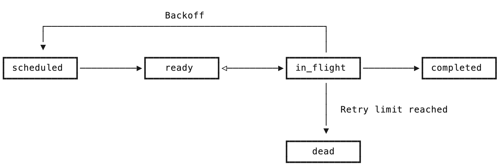
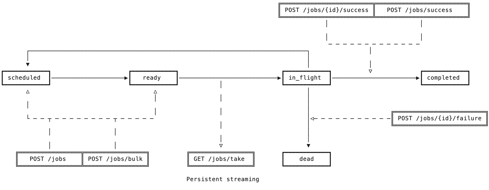

# Introduction

Zizq is a lightweight, self-contained and persistent job queue server with a
simple HTTP/2 and HTTP/1.1 API. Workers interact with the server to enqueue,
take, and process jobs.

If you have not yet installed Zizq, follow the
[Getting Started](/docs/getting-started) guide first. In most cases, you will
not need to directly interact with the API and will instead install and use a
client library for your specific programming language. You do not need to read
this API documentation if you are only using a client library.

> [!NOTE]
> Examples in this documentation use [HTTPie](https://httpie.io/), which is a
> command line HTTP client similar to cURL but much friendlier when working
> with JSON APIs.

## Base URL

All endpoints are relative to the base URL of the server, which by default is
on `127.0.0.1:7890` for both plain HTTP and HTTPS.

Plain HTTP:

```text
http://127.0.0.1:7890/{endpoint}
```

Secured with TLS:

```text
https://127.0.0.1:7890/{endpoint}
```

## Content Type

All endpoints support both JSON and [MessagePack](https://msgpack.org/) for
both request and response bodies. The default content type is JSON unless
otherwise specified by the `Accept:` and `Content-type:` headers. Examples in
this documentation will use JSON throughout for readability.

| Content type                                      | Name                   |
|---------------------------------------------------|------------------------|
| `application/json` _default_                      | JSON                   |
| `application/x-ndjson` _default_ _streaming_      | Newline Delimited JSON |
| `application/msgpack`                             | MessagePack            |
| `application/vnd.zizq.msgpack-stream` _streaming_ | MessagePack Stream     |

Payloads sent in MessagePack format have the same shape and data types as those
sent in JSON format.

### NDJSON

Newline delimited JSON appears as:

```json
{"id":"03fqs300nc99wa7twropnx7ed"}
{"id":"03fqznh2uh5ulpzcagbnw1um5"}


{"id":"03fqznjh9w5mz8ndyysrhs8my"}

{"id":"03fqznjnjo1gohd0k0s92m0e4"}
```

Where each JSON message is valid JSON, and messages are separated by one or
more `"\n"` newline characters, which the client skips.

### MessagePack Stream

Length-prefixed MessagePack streams are in the following format:

```text
[4-byte big-endian] [variable-length binary data]
[4-byte big-endian] [variable-length binary data]
...
[4-byte big-endian] [variable-length binary data]
```

The stream consists of 4-byte headers, which are 32-bit integers in big-endian
form and specify the following number of bytes that contain a valid MessagePack
payload. Empty messages may appear in the stream and are skipped by the client.
These are naturally identified by the fact they have a zero length
`\x00\x00\x00\x00`.

## Endpoint Versioning

In order to minimize bloat the server does *not* provide multiple versions of
each endpoint. Clients should [check the server version](./health.md)
for compatability. A change in the major version of the server indicates a
backwards-incompatible change, while minor version changes will always be
backwards-compatible. Clients should be upgraded accordingly, much like how a
major RDBMS version upgrade would be managed.

## Authentication

By default the server operates over plain HTTP and therefore should not be
exposed to the internet and only operated on trusted internal networks. Any
machine that can access the port can make API calls to the server. This is a
convenient default for local development.

### Plain TLS

Communication can be secured with through TLS by providing a certificate and
its key to the `zizq serve` command. In this mode the server should still be
limited to trusted internal networks.

### Mutual TLS

When operated with a [pro license](https://zizq.io/pricing) the server can be
secured with mutual TLS, requiring clients to present a client certificate. In
this mode the server is safe to expose to the internet. Only clients holding a
valid client certificate and key are able to communicate with the server.

> [!NOTE]
> Work is planned to implement optional access control (RBAC) using a
> combination of Mutual TLS and API keys with configured permissions.

## Common Concepts

It helps to understand some key concepts before reading the documentation for
each endpoint.

### IDs

All jobs are assigned a unique ID by the server that stays with that job for
its entire lifecycle. The ID is time-ordered and lexicographically sortable,
which enables FIFO (first-in, first-out) ordering of enqueued jobs within the
same priority.

### Priorities

Jobs have a 16-bit integer priority (`0` to `65536`). Lower values are
dequeued before higher values. The default is the midpoint `32768`. In practice
this means if 5,000 jobs are enqueued with priority `900` those jobs will be
processed in FIFO order, but if during processing a new job is enqueued with
priority `500` that job will be placed ahead of the existing jobs in the queue
and will be processed next.

### Queues

Zizq is structured as a collection of named queues. All jobs specify a queue
name onto which they are placed, and workers either take jobs from specific
queues, or from all queues combined. This enables logically separating
different types of workloads from others, for example so that some workers can
be scaled differently to others.

While the `queue` is a required input when enqueueing jobs, the exact value is
an arbitrary string specific to your application. The only restriction is that
they cannot contain the following reserved characters:
`,`, `*`, `?`, `[`, `]`, `{`, `}`, `\`. Queues do not need to be explicitly
created before they are first used.

Examples: `emails`, `billing.payments`.

### Timestamps

Jobs store a number of different timestamps across their lifecycle. All
timestamps in milliseconds since the Unix epoch.

| Timestamp      | Description                                                                    |
|----------------|--------------------------------------------------------------------------------|
| `ready_at`     | The time at which the job becomes, or became `ready`                           |
| `dequeued_at`  | The time at which the job entered the `in_flight` status                       |
| `failed_at`    | The time at which the job last failed                                          |
| `completed_at` | The time at which the job completed successfully                               |
| `purge_at`     | If the job is retained on completion, the time at which the job will be dropped by Zizq's internal reaper |

### Status

Jobs in Zizq can be in one of a number of statuses depending on where the job
is within its lifecycle.

<table>
    <thead>
        <tr>
            <th>Status</th>
            <th>Description</th>
        </tr>
    </thead>
    <tbody>
        <tr>
            <td><code>scheduled</code></td>
            <td>
                The job is not yet ready for processing. It's <code>ready_at</code>
                timestamp specifies when it becomes ready. Jobs can be in this
                status either because they were enqueued with a future-dated
                <code>ready_at</code> timestamp, or because they previously failed
                and are backing off (see <code>attempts</code> and
                <code>failed_at</code>).
            </td>
        </tr>
        <tr>
            <td><code>ready</code></td>
            <td>
                The job is ready for processing but has not been picked up by a
                worker. It's <code>ready_at</code> timestamp specifies when it
                entered this status.
            </td>
        </tr>
        <tr>
            <td><code>in_flight</code></td>
            <td>
                A worker has taken this job from the queue but has not yet sent
                an acknowledgement to indicate processing has completed. It's
                <code>dequeued_at</code> timestamp specifies when it was taken
                by the worker.
            </td>
        </tr>
        <tr>
            <td><code>completed</code></td>
            <td>
                The job was successfully processed by a worker. In practice
                jobs will only be visible in this status if the completed jobs
                retention policy is configured to retain successful jobs. It's
                <code>completed_at</code> timestamp specifies when the job was
                marked completed by the worker.
            </td>
        </tr>
        <tr>
            <td><code>dead</code></td>
            <td>
                The job exceeded its retry count and was killed by the server,
                or the worker explicitly killed the job to prevent further
                retries. It's <code>failed_at</code> timestamp specifies when
                the job last failed, and a full list of errors is available
                through the errors endpoint.
            </td>
        </tr>
    </tbody>
</table>

### Backoff

Applications are not perfect. The world can be unpredictable. Systems can be
unreliable and jobs may fail. When this happens, Zizq automatically reschedules
the job with an increasing delay up until a maximum number of retries.

### Retention

When jobs reach the end of their lifecycle, either because they completed
successfully, or because they failed too many times, Zizq can be configured to
keep the job data for a period of time to aid with debugging. By default Zizq
retains `dead` jobs for 7 days,  but drops `completed` jobs immediately. Both
of these behaviours are configurable.

### Job Lifecycle

Jobs progress through the different statuses as their lifecycle progresses.



Upon enqueue, a job begins either in the `scheduled` status or in the `ready`
status, depending on the value optionally specified in the `ready_at` timestamp
when enqueueing the job. Scheduled jobs are automatically promoted to `ready`
by Zizq's internal job scheduler.

Jobs enter the `in_flight` status when they are dequeued by a worker and they
remain in this status until the worker either notifies success or failure, or
is disconnected for any reason, at which point Zizq automatically returns the
job to the `ready` status. In the event of a system failure, such as low of
power, Zizq automatically returns any `in_flight` jobs to the `ready` status.

When a worker notifies the Zizq server that an `in_flight` job completed
successfully, that job moves into the `completed` status and is either dropped
immediately, or retained for a period of time according to the job retention
policy.

When a worker notifies the Zizq server that an `in_flight` job failed due to an
error, Zizq records the error against the job, checks how many times that job
has failed and then either reschedules the job according to the backoff policy,
or marks the job `dead`. Dead jobs are retained for a period of time by default,
but may be immediately dropped depending on the retention policy.

Clients call the endpoints in the following sequence. Enqueues happen
concurrently with workers processing jobs.



1. Application [enqueues jobs](./enqueue.md) with `POST /jobs` or
   `POST /jobs/bulk`.
2. Workers take those jobs by streaming them over a persistent connection on
   `GET /jobs/take`. The server does not close this connection.
3. Upon success, workers notify the Zizq API with `POST /jobs/{id}/success` or
   `POST /jobs/success` (bulk).
4. Upon failure, workers notify the Zizq API with `POST /jobs/{id}/failure`.
   Zizq may schedule this job for a retry.
