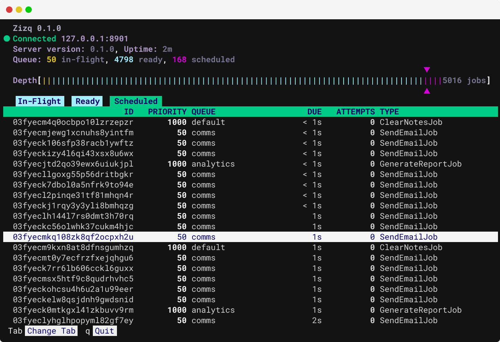

# Viewing Live Activity in `zizq top`

The Zizq CLI ships with a built-in terminal UI that shows your queues operating
in real-time. Run `zizq top` to launch the terminal UI.

```shell
zizq top
```



## UI Layout

The terminal UI includes a number of components which are described here.

### Header Section

At the top of the screen is the connection status. Ths displays the URL that
`zizq top` is connected, or connecting to, along with the version of `zizq top`
itself, and the version of Zizq running on the sever. Uptime of the Zizq server
is also displayed here.

We then have some basic statistics showing the number of jobs in various
lifecycle states.

Below the lifeycle states is the _depth indicator_, which is similar to a
scrollbar. As you scroll within the list(s) on each tab, the markers indicate
where you are within the overall queue, which provides a clear visual
representation of the queue depth.

### Function Bar

At the bottom of the view is a function bar which provides hints for some key
functions. Most easily discoverable controls (e.g. arrow keys) are not
displayed here.

### Content Section

There are currently three tabs in the content section which occupies most of
the space:

* In-Flight
* Ready
* Scheduled

These are essentially ordered by the reverse lifecycle of a job while the job
is active. Press `Tab` or `Shift-Tab` to switch between the tabs, and use the
arrow keys to navigate within each tab.

The content section can be split to show both the basic list and a detail panel
which includes more detail such as the payload and full timestamps.

## Specifying the Connection

`zizq top` works by connecting to an
[Admin API](./serve.md#configuring-the-admin-api) which runs on a different
port number to the [Primary API](./serve.md#configuring-the-listen-address)
so that it can be secured differently. By default `zizq top` will attempt to
connect to `http://localhost:8901` which is the default and what is likely
configured when Zizq is running locally. In production environments you may
need to specify a different host or port number, and/or URL scheme. Provide the
`--url` flag (or the `ZIZQ_ADMIN_URL` environment variable) when starting
`zizq top` in order to connect to a different endpoint.

```shell
zizq top --url https://your.server.host:8901
```

The the Admin API has been secured with Mutual TLS, specify `--client-cert`
and `--client-key` (or `ZIZQ_ADMIN_TLS_CLIENT_CERT` and
`ZIZQ_ADMIN_TLS_CLIENT_KEY`) to connect with your client certificate.

## UI Controls

All interaction with the terminal UI is driven through the keyboard. Some— but
not all— hints are displayed in the function bar at the bottom of the view. We
cover the possible interactions in detail here.

### Exiting the Terminal UI

`zizq top` switches to the alternate screen and takes over the terminal window.
To exit, press `q`, or `Ctrl-C`.

### Scrolling the Job List

If the list exceeds the size of the viewport, use the `Up`, `Down`, `PageUp`
and `PageDown` keys to scroll within the list. The `Left` and `Right` arrow
keys can be used to scroll horizontally if the viewport is sized narrower than
the list.

Additionally, pressing `g` or `Home` jumps to the start of the list, and
pressing `G` or `End` jumps to the end of the list.

### Switching Tabs

There are a series of tabs in the terminal UI displaying jobs in different
stages of their lifecycle. To switch between them, press `Tab` or `Shift-Tab`.

### Toggling the Detail Panel

By default, only basic job info is displayed on each tab. To view full details
including the payload of the job, press `i`. This splits the view, presenting
the details in a panel below the list. As the job beneath the cursor changes,
the details displayed in the detail panel are updated.

Press `i` again to close the detail panel.
